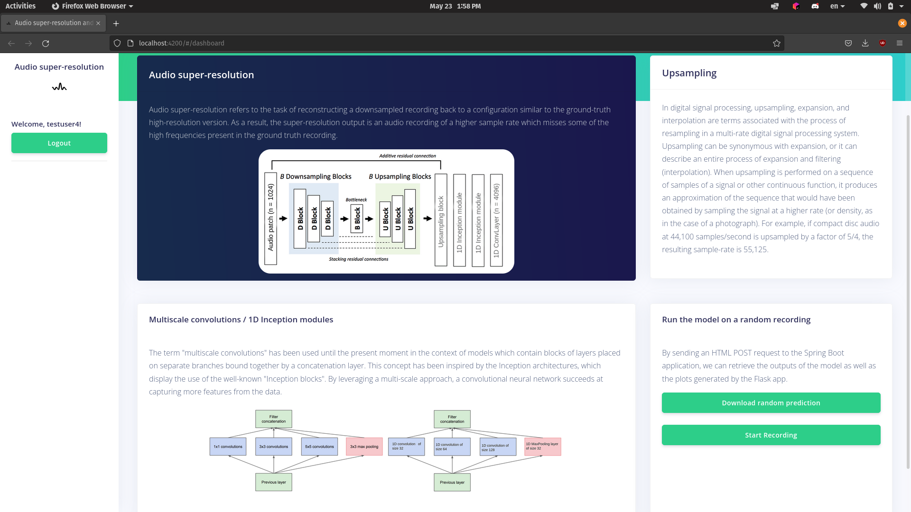

# Audio-Super-Resolution-Spring-Angular-Project
A simple Spring/Angular project presenting the audio super-resolution B.S. thesis

## Current state of the UI

### Dashboard

### Login page

### Register page

## Basic UML diagrams of the classes currently created

## Resources
- [How to install and setup PostgreSQL on Ubuntu 20.04](https://www.cherryservers.com/blog/how-to-install-and-setup-postgresql-server-on-ubuntu-20-04)
- [Getting started with Tensorflow and Spring](https://blog.mimacom.com/getting-started-tensorflow-spring/)
- [Be Functional With Java — get rid of if/else null checks with Vavr’s Option](https://blog.softwaremill.com/be-functional-with-java-get-rid-of-if-else-null-checks-with-vavrs-option-c3d3de7a5c1d)
- [Spring Boot/Angular JWT Authentication](https://www.javainuse.com/spring/boot-jwt)
- [Spring Boot/Angular + Database JWT Authentication](https://www.javainuse.com/spring/boot-jwt-mysql)
- [RestTemplate vs. WebClient](https://www.baeldung.com/spring-webclient-resttemplate)

